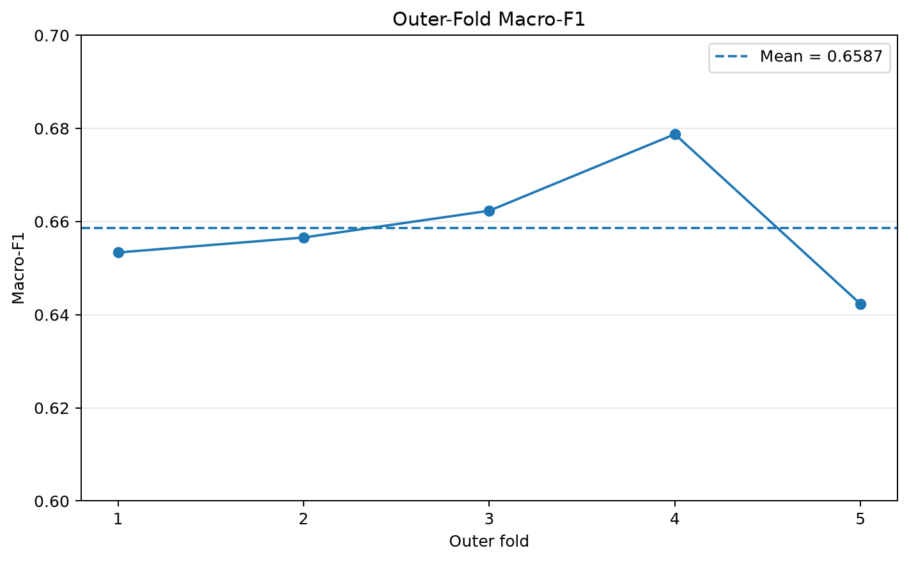
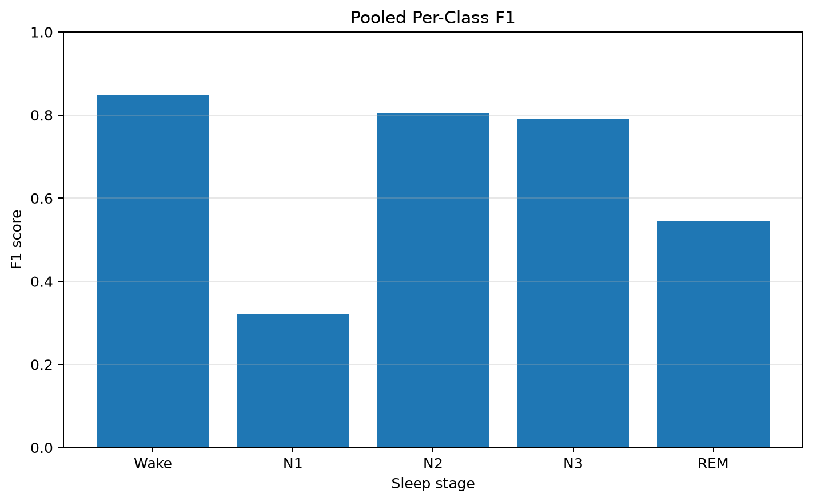
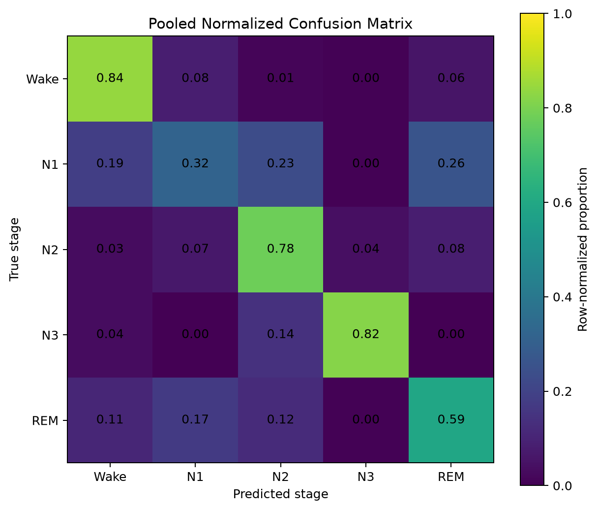
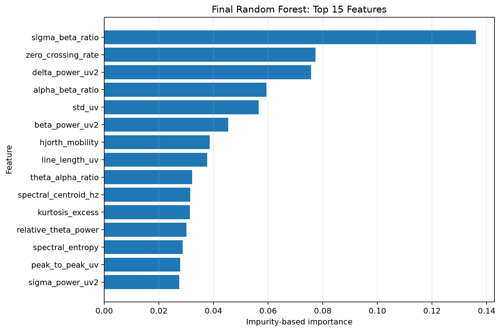

# Phase 3 Full-Dataset Scientific Report

## Evaluation protocol

The final evaluation used subject-grouped nested validation. Each epoch
was evaluated exactly once in an outer test fold, while model selection
was restricted to development subjects.

The evaluation covers **195,469 epochs** from
**78 subjects** and five sleep-stage classes: Wake, N1, N2, N3, and REM.

## Main results

| Metric | Value |
|---|---:|
| Mean outer Macro-F1 | 0.658662 |
| Outer Macro-F1 standard deviation | 0.011977 |
| Mean outer balanced accuracy | 0.667571 |
| Pooled accuracy | 0.727988 |
| Pooled balanced accuracy | 0.670416 |
| Pooled Macro-F1 | 0.661936 |
| Pooled weighted F1 | 0.730934 |

The best outer fold was fold
**4**
with Macro-F1 **0.678755**.
The lowest fold result was fold
**5**
with Macro-F1 **0.642303**.

## Outer-fold results

| Fold | Test epochs | Accuracy | Balanced accuracy | Macro-F1 |
|---:|---:|---:|---:|---:|
| 1 | 43,429 | 0.7024 | 0.6648 | 0.6534 |
| 2 | 34,487 | 0.7325 | 0.6684 | 0.6566 |
| 3 | 41,371 | 0.7420 | 0.6774 | 0.6623 |
| 4 | 38,678 | 0.7557 | 0.6819 | 0.6788 |
| 5 | 37,504 | 0.7094 | 0.6454 | 0.6423 |

## Per-class performance

| Class | Support | Precision | Recall | F1 |
|---|---:|---:|---:|---:|
| Wake | 65,941 | 0.8543 | 0.8411 | 0.8476 |
| N1 | 21,522 | 0.3221 | 0.3195 | 0.3208 |
| N2 | 69,132 | 0.8316 | 0.7807 | 0.8053 |
| N3 | 13,039 | 0.7650 | 0.8172 | 0.7902 |
| REM | 25,835 | 0.5050 | 0.5937 | 0.5457 |

Wake, N2, and N3 achieved the strongest pooled class-level results.
N1 was the most difficult stage, followed by REM. This pattern indicates
that transitional and spectrally overlapping stages remain the main
source of classification uncertainty.

## Error analysis

| Rank | True class | Predicted class | Count | Rate within true class |
|---:|---|---|---:|---:|
| 1 | N2 | REM | 5,674 | 8.21% |
| 2 | N1 | REM | 5,585 | 25.95% |
| 3 | Wake | N1 | 5,512 | 8.36% |
| 4 | N1 | N2 | 4,966 | 23.07% |
| 5 | N2 | N1 | 4,522 | 6.54% |
| 6 | REM | N1 | 4,424 | 17.12% |
| 7 | N1 | Wake | 3,993 | 18.55% |
| 8 | Wake | REM | 3,734 | 5.66% |
| 9 | REM | N2 | 3,144 | 12.17% |
| 10 | REM | Wake | 2,818 | 10.91% |

The largest confusion pairs involve N1, REM, and N2. These errors should
be interpreted as empirical model behavior rather than evidence of
clinical equivalence between stages.

## Final model

The final deployment artifact is a Random Forest selected as
`random_forest__candidate_002`.

| Rank | Feature | Importance |
|---:|---|---:|
| 1 | sigma_beta_ratio | 0.136021 |
| 2 | zero_crossing_rate | 0.077343 |
| 3 | delta_power_uv2 | 0.075747 |
| 4 | alpha_beta_ratio | 0.059378 |
| 5 | std_uv | 0.056556 |
| 6 | beta_power_uv2 | 0.045369 |
| 7 | hjorth_mobility | 0.038646 |
| 8 | line_length_uv | 0.037733 |
| 9 | theta_alpha_ratio | 0.032175 |
| 10 | spectral_centroid_hz | 0.031494 |
| 11 | kurtosis_excess | 0.031370 |
| 12 | relative_theta_power | 0.030079 |
| 13 | spectral_entropy | 0.028683 |
| 14 | peak_to_peak_uv | 0.027798 |
| 15 | sigma_power_uv2 | 0.027494 |

The highest-ranked feature was `sigma_beta_ratio`. Feature importance is
impurity-based and model-specific; it must not be interpreted as causal
or as a clinical biomarker.

## Reproducibility

- Group column: `subject_id`
- Primary selection metric: Macro-F1
- Random epoch splitting: prohibited
- Final model candidate: `random_forest__candidate_002`
- Final model SHA-256:
  `354484d39f5313981c1d164e30738adfafe0d18d33ee5da9854584a16337f820`
- MLflow registered model: `EEG_Sleep_Stage_Classifier`
- MLflow alias: `champion`

## Limitations

The dataset is imbalanced, and N1 has substantially weaker performance
than the other stages. Results may not generalize to other EEG channels,
acquisition devices, scoring conventions, or populations without
external validation.

This project is an educational machine-learning system and is not a clinical diagnostic tool.
